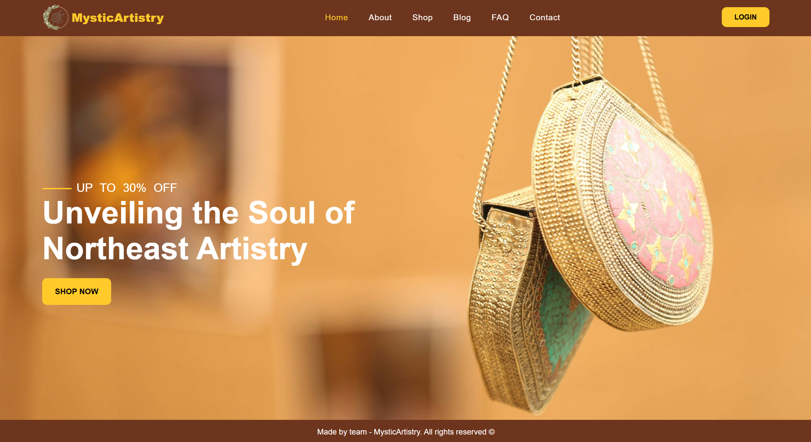
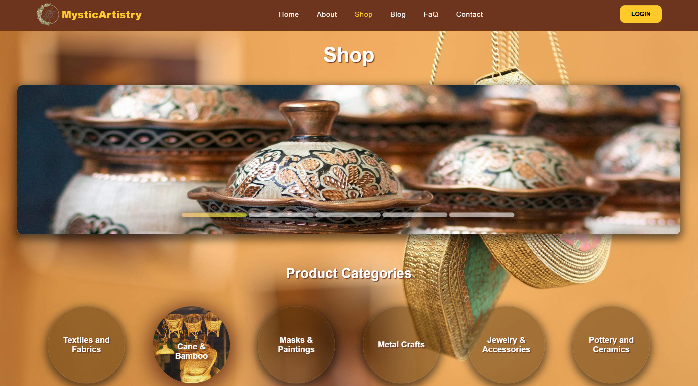
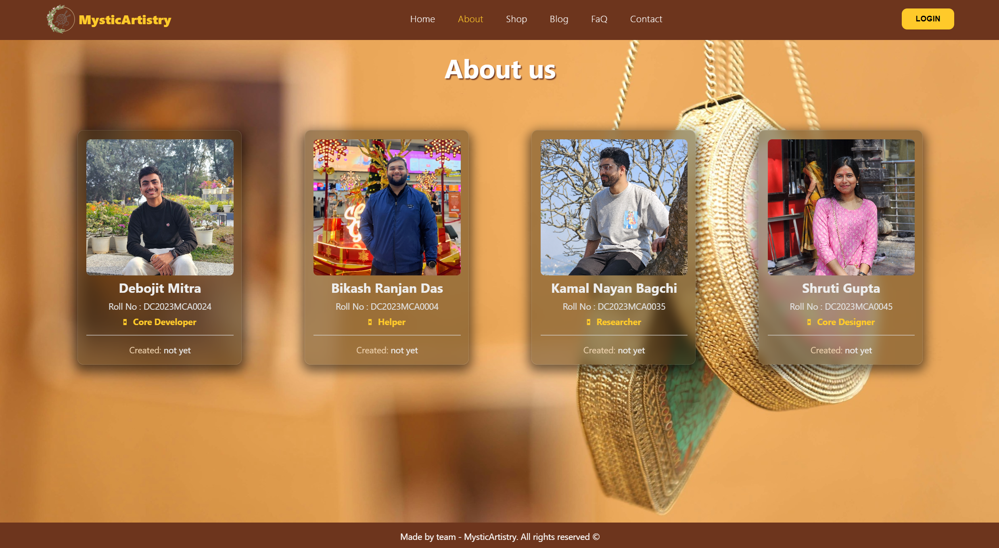
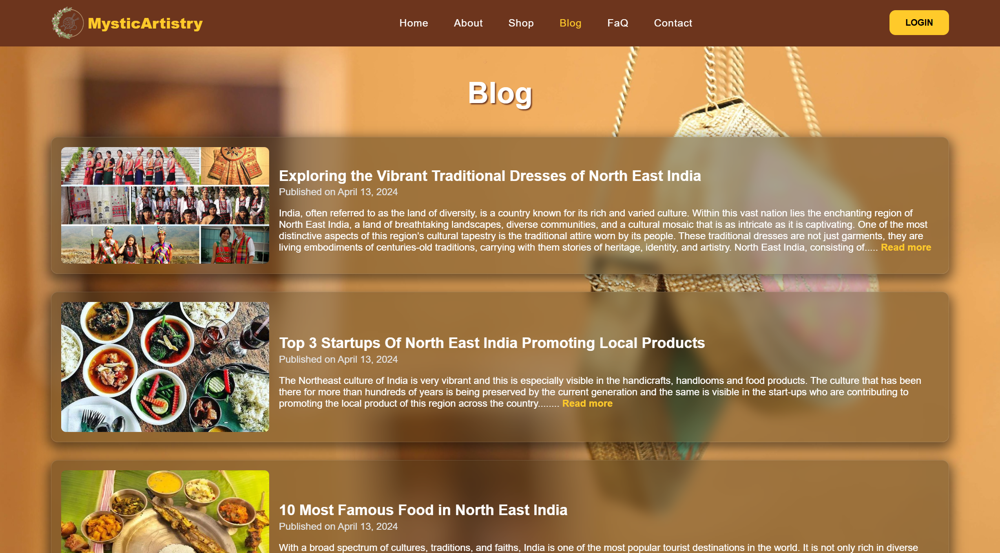
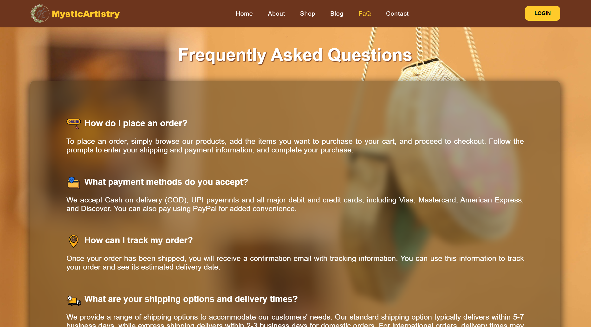
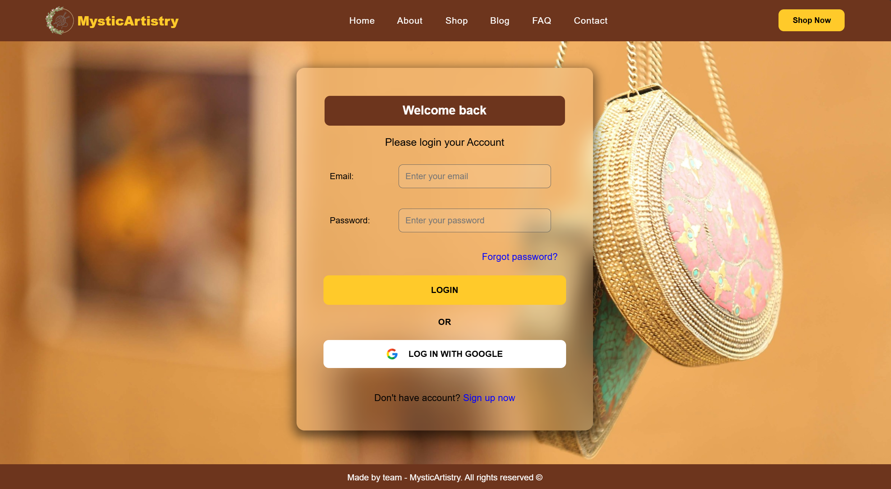

# MysticArtistry

Welcome to **MysticArtistry**, a website dedicated to showcasing and promoting the beauty and craftsmanship of Northeast Handicrafts.

## Features
- **Explore Handicrafts**: Discover a wide range of unique handmade items from the Northeast.
- **Artist Profiles**: Learn about the talented artisans behind the crafts.
- **Online Store**: Purchase beautiful handicrafts directly from the website.
- **Cultural Insights**: Gain insights into the rich cultural heritage of the Northeast.
- **User Reviews**: Read and share reviews about different handicrafts.

## Screenshots

## About the Project
This project aims to support and promote the traditional handicrafts of the Northeast, providing artisans with a platform to showcase and sell their work. By bridging the gap between artisans and customers, we hope to foster appreciation for these beautiful crafts and contribute to the preservation of cultural heritage.
